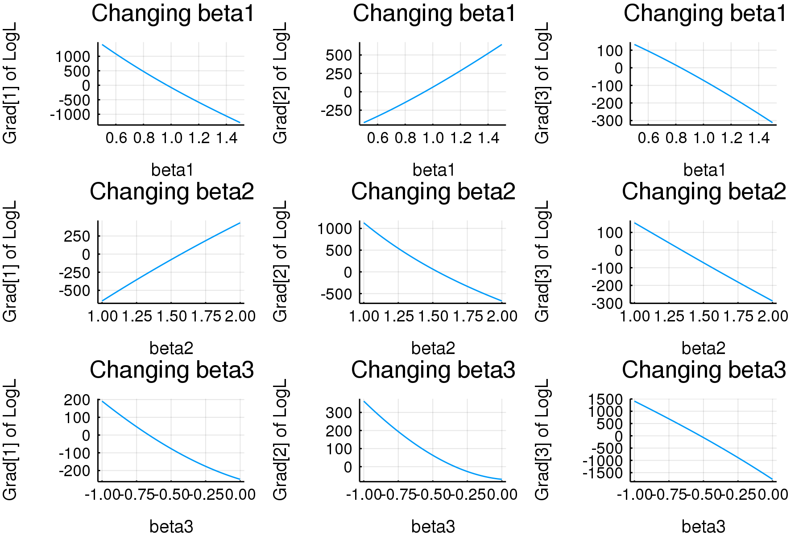

# HWunconstrained

[](https://travis-ci.com/ScPo-CompEcon/HWunconstrained.jl)
[](https://codecov.io/gh/ScPo-CompEcon/HWunconstrained.jl)


## Your Plots

* plot of objective function


* plot of gradient



## HOW TO DO THIS HOMEWORK

1. github classroom will create a fork of this for you.
2. in your local julia session, you need to do
    ```julia
    ] dev https://github.com/YOUR_GITHUB_USER/HWunconstrained.jl.git
    ```
3. next, go to the newly created directory to instantiate the package:
    ```julia
    cd(joinpath(DEPOT_PATH[1],"dev","HWunconstrained"))  # go to package location
    ] activate .  
    ] instantiate
    ```
4. Now you can go back to the main environment and start editing the code in your text editor
    ```julia
    ] activate    # no args goes back to main
    using HWunconstrained    # precompiles
    makeData()     # errors: function is incomplete! go and complete it in your editor!
    ```
5. When you add a unit test in `/test/runtest.jl`, you can try it out by doing
    ```julia
    # if in the package directory:
    ] activate .   
    ] test       

    # from any other location
    ] test HWunconstrained
    ```
6. To submit: 
    ```bash
    cd ~/.julia/dev/HWunconstrained
    git add .   # adds everything. edit if that's not what you want
    git commit -m 'my homework'
    git push
    ```
